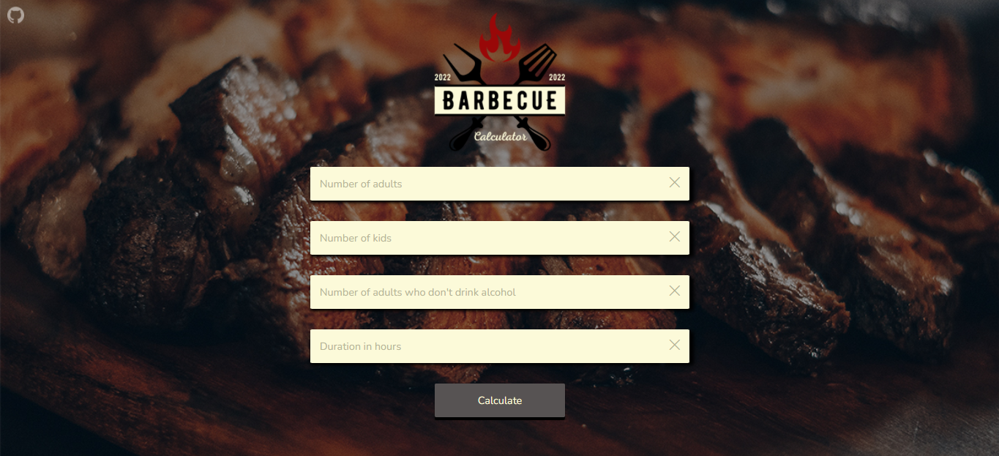

# Barbecue Calculator Website

## [SITE HERE](https://isabdch.github.io/bbq-calculator/)

## Table of Contents

- [Project Description](#project-description)
- [Status](#status)
- [Inspiration](#inspiration)

## Project Description

This website's purpose is to calculate the amount of meat, beer, and any other drink you will need to make a barbecue depending on the number of adults, kids, adults who don't drink alcohol and the duration of the barbecue (in hours).

Project is created with:

- ### HTML

  To create basic HTML content, buttons, inputs, etc.

- ### CSS

  To stylize the HTML elements. I used [Canva](https://www.canva.com/) to help me with the design.

- ### JavaScript

  I created multiple events and functions to make all the calculations and the interactivity. I also used localStorage to save the data.

## Status

This project is finished. 
